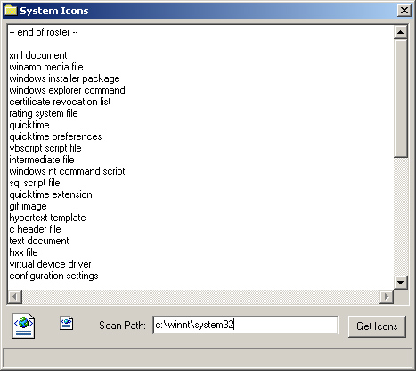



## System Icon List

### Description

A simple class that accepts a filename or folder and grabs the system icons (large & small) and stores them internally for use by picture, listview, treeview. Provides a roster of all icons it currently has stored. Duplicates are automatically removed. Uses API (SHFILEINFO, WIN32_FIND_DATA, OleCreatePictureIndirect)
 
### More Info
 

             |
---                |---
**Submitted On**   |2002-06-19 10:22:10
**By**             |[Hexie](https://github.com/Planet-Source-Code/PSCIndex/blob/master/ByAuthor/hexie.md)
**Level**          |Intermediate
**User Rating**    |4.0 (8 globes from 2 users)
**Compatibility**  |VB 6\.0
**Category**       |[Windows System Services](https://github.com/Planet-Source-Code/PSCIndex/blob/master/ByCategory/windows-system-services__1-35.md)
**World**          |[Visual Basic](https://github.com/Planet-Source-Code/PSCIndex/blob/master/ByWorld/visual-basic.md)
**Archive File**   |[System\_Ico964936192002\.zip](https://github.com/Planet-Source-Code/hexie-system-icon-list__1-36021/archive/master.zip)

